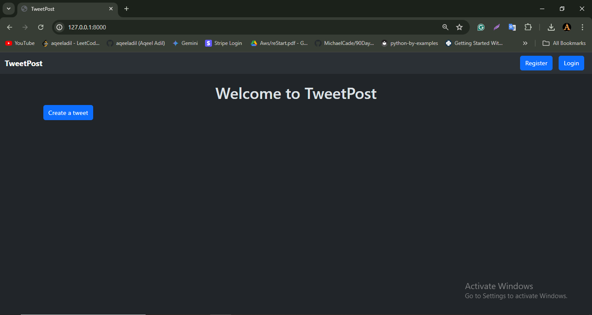
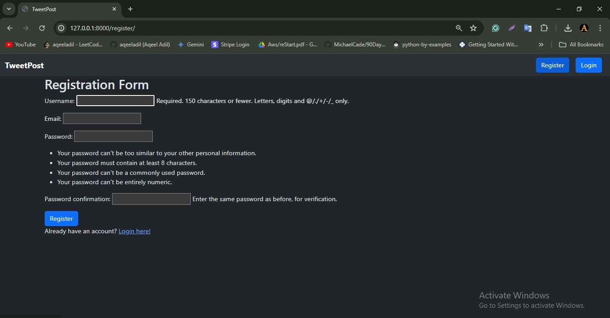
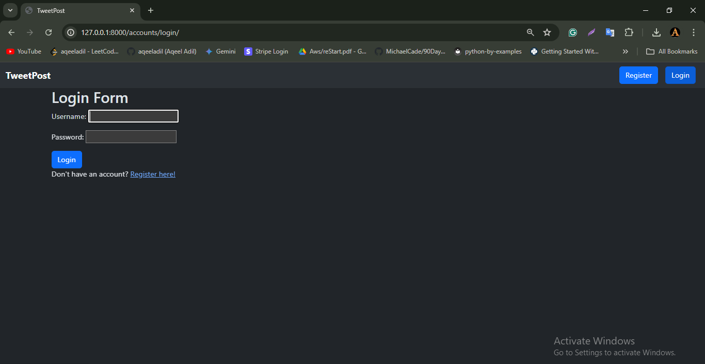
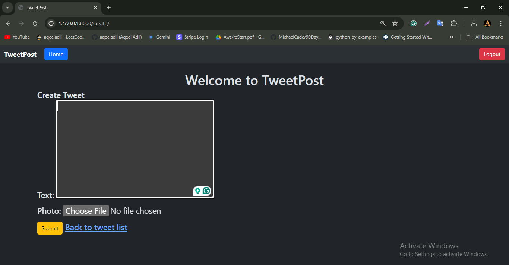
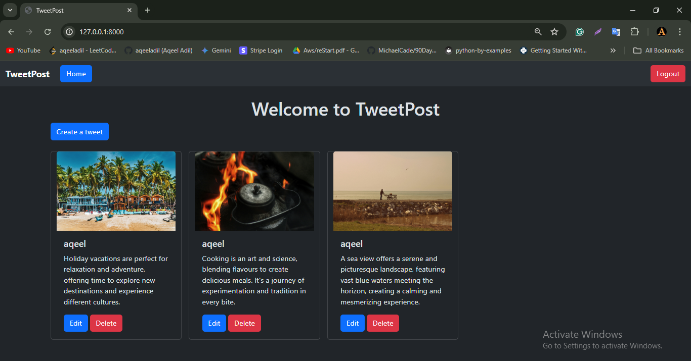
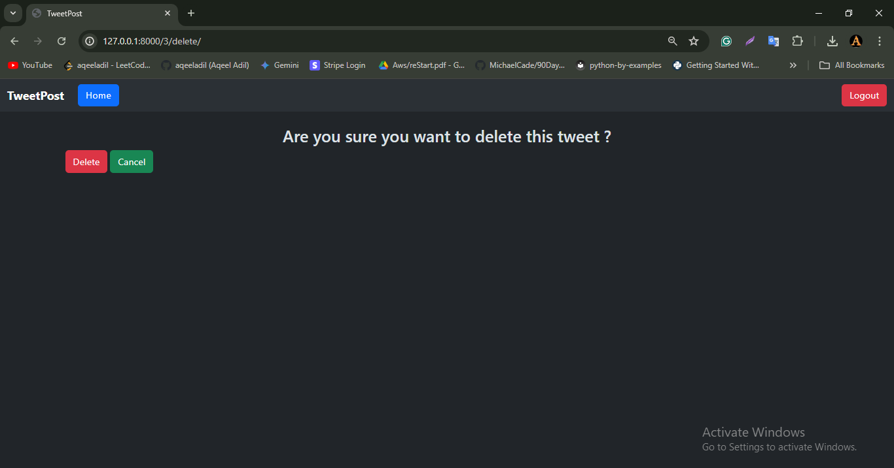
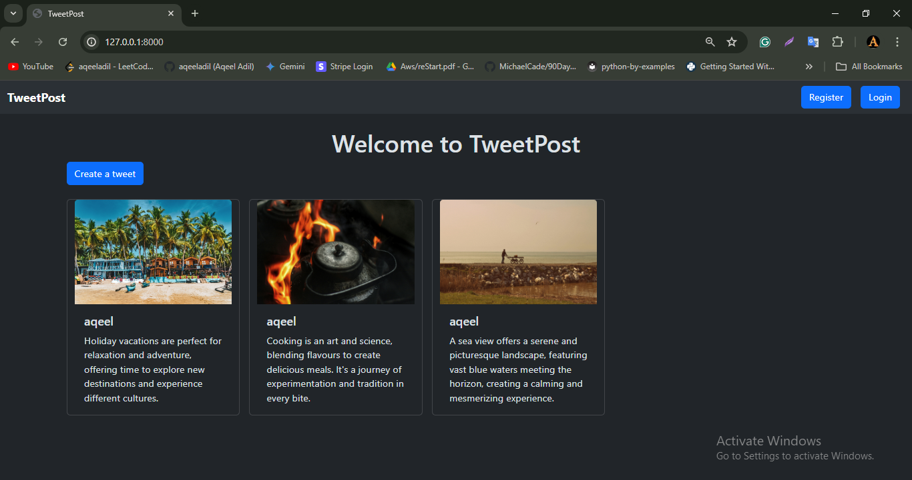

# TweetPost 
Welcome to the TweetPost - a Social Media Application! that let users create, update and delete tweets on the tweetpost platform. 

## Live Demo
You can access the live project [here](http://aqeeladil.site).

<br>

**To set up the project locally, run these commands:**

```bash
git clone https://github.com/aqeeladil/tweetpost.git
cd tweetpost
```

```bash
python -m venv venv
source venv/bin/activate  # On Windows use `venv\Scripts\activate`
```

```bash
pip install -r requirements.txt
```

```bash
cd tweetpost
```

```bash
python manage.py makemigrations
python manage.py migrate
python manage.py runserver
```

<be>

Now open http://127.0.0.1:8000/ in your browser to view this project

<br><br>

**Here is a quick image display for the whole application.**


<br>

<br>

<br>

<br>

<br>

<br>

<br><br>


        